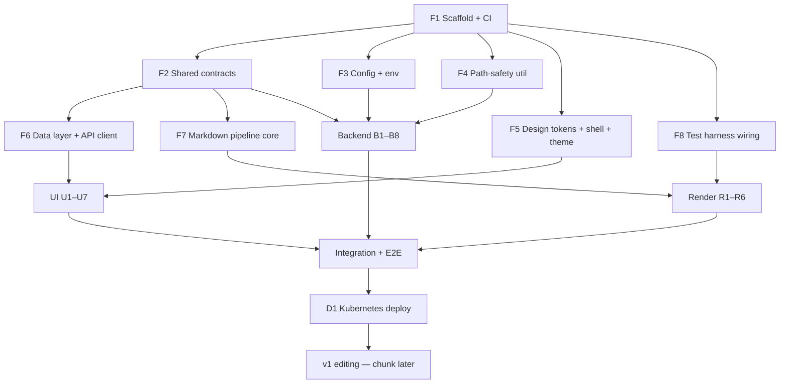

# Task Breakdown — Parallel Agent Offload

The [implementation plan](../implementation-plan.md) sequences the *what*. This directory splits it into **tightly-scoped, self-contained task cards** that can each be handed to a separate agent. Each card is written so a cold-start agent can execute it from the card + the referenced spec sections alone.

## How to use this

1. **Build the Foundations (`F*`) first, in order.** They establish the shared contracts, config, path-safety, design tokens, data layer, markdown pipeline, and test harness. Everything else builds against these. Do **not** parallelize foundations — they define the interfaces the parallel work depends on.
2. **Once all `F*` are merged, fan out.** `B*` (backend endpoints), `R*` (markdown render components), and `U*` (UI shells) are mutually parallel-safe because each owns a disjoint set of files and only *consumes* the frozen contracts.
3. Hand an agent **one card**. The card lists what to read, what it owns, what it must not touch, and its acceptance criteria.

## Dependency graph

## Task list

**Foundations (sequential, core):**
| ID | Title | Depends |
| :-- | :-- | :-- |
| [F1](F1-scaffold.md) | Monorepo scaffold, build, CI skeleton | — |
| [F2](F2-contracts.md) | Shared API contract types (`@wiki/contracts`) | F1 |
| [F3](F3-config.md) | Config loader + env validation + `.env.example` | F1 |
| [F4](F4-path-safety.md) | Path-safety / traversal-guard utility | F1 |
| [F5](F5-shell-theme.md) | Design tokens, app shell layout, theme provider | F1 |
| [F6](F6-data-layer.md) | Data layer (React Query + Zustand) + typed API client | F2 |
| [F7](F7-markdown-pipeline.md) | Markdown pipeline core (sanitize/iframe policy, callouts, slug/TOC) | F2 |
| [F8](F8-test-harness.md) | Vitest + Playwright + coverage-guard wiring | F1 |

**Backend endpoints (parallel; each depends on F2–F4):**
| ID | Title |
| :-- | :-- |
| [B1](B1-health-bootstrap.md) | `/api/health` + repo-cache bootstrap + git credential provider |
| [B2](B2-tree.md) | `/api/tree` (frontmatter title/order/hidden) |
| [B3](B3-doc.md) | `/api/doc` |
| [B4](B4-asset.md) | `/api/asset` (streaming, extension allowlist) |
| [B5](B5-history.md) | `/api/history` (`git log --follow --`, safe) |
| [B6](B6-search.md) | `/api/search` (MiniSearch index) |
| [B7](B7-sync.md) | `/api/sync/pull` + background poller + reindex hook |
| [B8](B8-auth.md) | Auth middleware (JWT/JWKS) + `/api/auth/{me,dev,logout}` + guardrail |

**Markdown render components (parallel; each depends on F7 + F8):**
| ID | Title |
| :-- | :-- |
| [R1](R1-code-blocks.md) | Code blocks (highlight, lang tag, copy) |
| [R2](R2-mermaid.md) | Mermaid (lazy) |
| [R3](R3-math.md) | Math (KaTeX) |
| [R4](R4-callouts.md) | Callouts (NOTE/TIP/WARNING/CAUTION) |
| [R5](R5-iframe-embed.md) | Iframe embed + disallowed-host placeholder |
| [R6](R6-images-links.md) | Images (asset resolution) + internal-link rewriting |

**UI shells (parallel; each depends on F5 + F6):**
| ID | Title |
| :-- | :-- |
| [U1](U1-sidebar.md) | Left sidebar tree (title labels, ordering, states) |
| [U2](U2-toc.md) | Right TOC + scroll-spy |
| [U3](U3-content-routing.md) | Content view + routing/deep links + 404 + states |
| [U4](U4-search-modal.md) | Search modal (⌘K, focus trap, keyboard nav) |
| [U5](U5-header.md) | Header (logo, search trigger, sync status, theme toggle) |
| [U6](U6-history-drawer.md) | History drawer |
| [U7](U7-auth-ui.md) | Auth UI (SSO redirect, user chip, dev card, `canWrite` gating) |

**Then:** [D1 — Kubernetes deploy](D1-deploy.md). **v1 editing** (M5) is chunked *after* v0 lands — see [implementation plan](../implementation-plan.md) M5.

## Definition of Done (applies to every card)

An agent's task is complete only when **all** of these hold — cards list only their *additional* specifics:

- **Contracts respected**: types come from `@wiki/contracts` (F2); no divergent local redefinitions. Backend responses and frontend consumers match the contract exactly.
- **Owns-only**: the change touches only files in the card's *Owns* list. Shared files (contracts, tokens, pipeline) are consumed read-only. This is what keeps parallel work merge-clean.
- **Lint + typecheck clean**; no `any` on public interfaces.
- **Tests**:
  - Logic → Vitest unit tests.
  - Render components (`R*`) → L1 DOM assertions + L2 snapshot + **L3 light/dark baseline** for their manifest element; the coverage guard stays green ([testing-markdown-rendering.md](../../specs/testing-markdown-rendering.md)).
  - Endpoints with a `path` param → include a path-traversal rejection test ([security-and-safety.md](../../specs/security-and-safety.md)).
- **No secrets in code**; all config via env per [configuration.md](../../specs/configuration.md).
- **States**: any async UI surface implements loading/empty/error per [features spec §10](../../specs/wiki-features-specification.md).
- **PR** references the task ID and the spec sections it implements.

## Agent handoff template

> Implement task **`<ID>`** in this repo. Read the card at `docs/plans/tasks/<ID>-*.md` and the spec sections it lists, plus `docs/plans/tasks/README.md` (Definition of Done). Only modify files in the card's *Owns* list. Do not change shared contracts, design tokens, or the markdown pipeline. Open a PR that satisfies the Definition of Done.
