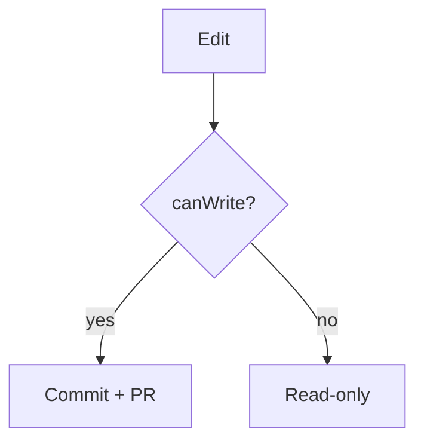

# Kitchen Sink

Every supported element on one page — used for a full-page visual baseline and as a smoke test that elements compose without interfering.

## Text

Plain paragraph with **bold**, *italic*, ***bold italic***, ~~strikethrough~~, `inline code`, and a [relative link](./headings.md).

## Lists

- Bullet
  - Nested bullet
- [x] Done task
- [ ] Open task

1. One
2. Two

## Code

```typescript
const canWrite = (claims: { provider: string }) => claims.provider === "github";
```

## Table

| Provider | Capability |
| :------- | :--------- |
| github   | read+write |
| firebase | read-only  |

## Blockquote

> Docs are authored in git but rendered for everyone.

## Callouts

> [!TIP]
> Composition check: a callout next to other blocks.

> [!CAUTION]
> Danger callout for the dark/light tint baseline.

## Image


*A captioned image.*

## Embed

<iframe src="https://www.youtube-nocookie.com/embed/dQw4w9WgXcQ" title="Embed"></iframe>

## Diagram



## Math

Inline $a^2 + b^2 = c^2$ and block:

$$
e^{i\pi} + 1 = 0
$$
