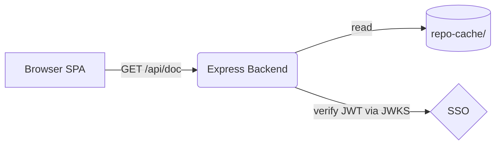
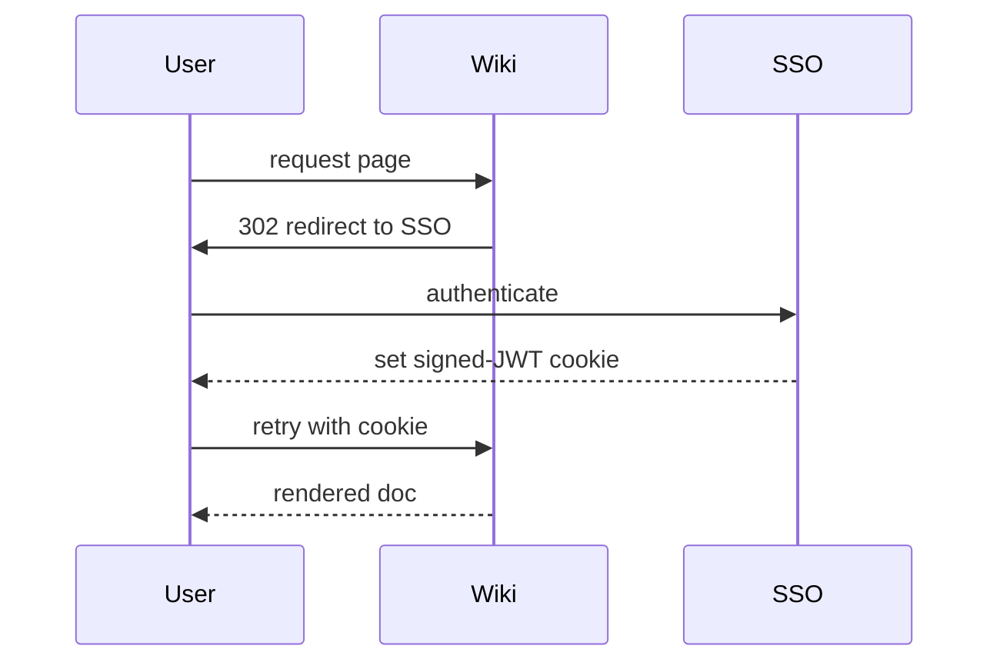

# Mermaid Diagrams

A flowchart (```mermaid fence must render to inline SVG, themed to light/dark):



A sequence diagram:



A deliberately invalid diagram — must render an isolated inline error card, NOT crash the page or the other diagrams above:

```mermaid
flowchart LR
    A -->
    this is not valid mermaid syntax {{{
```
