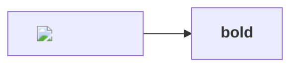
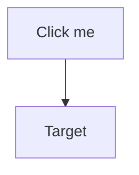
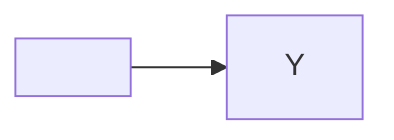

# Mermaid — Injection Attempts

Mermaid renders client-side **after** `rehype-sanitize`, so these must be neutralized by mermaid's own `securityLevel: 'strict'` config, not the rehype allowlist. None may execute script, bind a click/navigation, or inject raw HTML.

## HTML label injection

## click / callback interaction directive

## %%{init}%% security downgrade attempt

Assertions: rendered SVG contains **no** `<script>`, **no** `on*` attributes, **no** `<foreignObject>` carrying HTML, and **no** `href`/click handler beginning with `javascript:`; `window.__pwned` is never set; the author-supplied `securityLevel: loose` is ignored.
